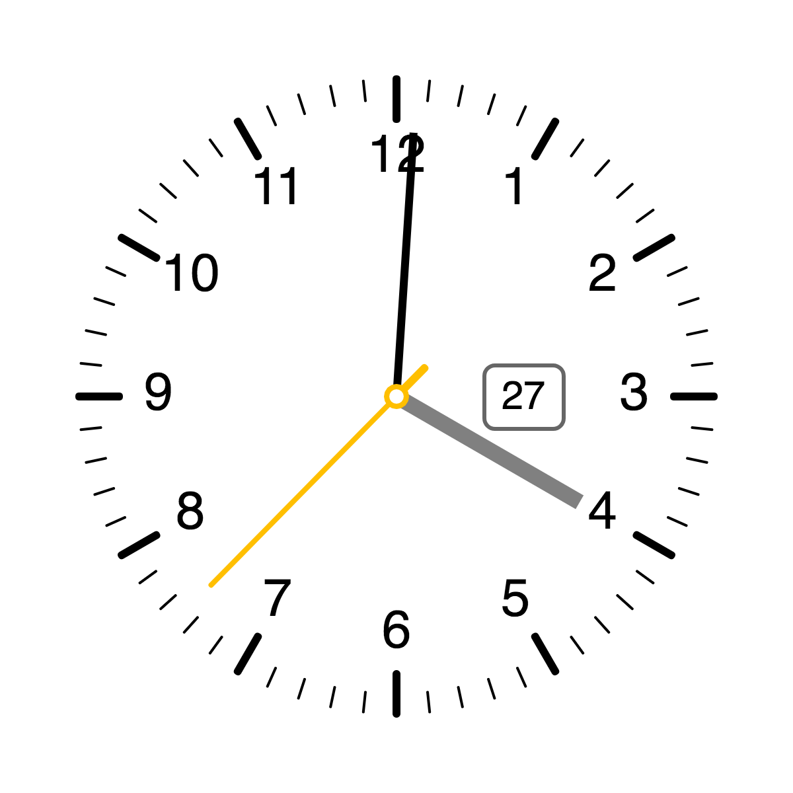

# clock-p5js

_A clock made with [p5.js](https://p5js.org) for the Interaction Design course in my second semester at [Anhalt University of Applied Sciences](https://hs-anhalt.de)_

## Task

Create a clock showing seconds, minutes and hours using the JavaScript library [p5.js](https://p5js.org). It should resemble the archetype clock we all know.

## Features

- analog watchface inspired by [Braun watches](https://braun-clocks.com)
- smoothly moving hands
- day display
- night mode (using [p5.geolocation](https://github.com/bmoren/p5.geolocation) and [Sunrise Sunset API](https://sunrise-sunset.org/api))
- toggle hour labels and day display
